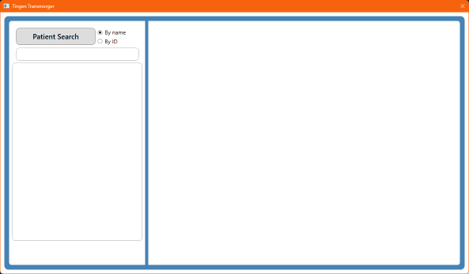

<!-- 260326 -->

<!--
  This section contains the project logo and various details.

  There are references for both a "light" and "dark" images. The dark image
  should have a background of HEX #0d1117, to match the dark mode of GitHub.
  The light image is the fallback.
-->

  <picture>
    <source media="(prefers-color-scheme: dark)" srcset=".github/repository/logo/TransmorgerLogo-256x256.png">
    <source media="(prefers-color-scheme: light)" srcset=".github/repository/logo/TransmorgerLogo-256x256.png">
    
  </picture>

   

  &nbsp;&nbsp;
  &nbsp;&nbsp;
  &nbsp;&nbsp;
  &nbsp;&nbsp; &nbsp;&nbsp; 

***

<!--
  Optional screenshot
-->

  

  ##### The Tingen Transmorger main window

***

<!--
  Optional menu.

  These are things that aren't/don't belong in the Table of Contents.

  Use whichever components you want/need. 
-->

<h6 align="center">

[Changelog](docs/CHANGELOG.md)&nbsp;&bull;&nbsp;[Roadmap](docs/ROADMAP.md)&nbsp;&bull;&nbsp;[Known issues](docs/KNOWN-ISSUES.md)&nbsp;&bull;&nbsp;

</h6>

<!-- 
  Table of contents.

  These are things that aren't/don't belong in the Menu.
  
  The HTML indentations have to stay this way to work.
-->

<table>
<tr>
<td img src="repository-data/image/document/readme/spacer.png" alt="blank-spacer" width="1000" height="1">

  ### CONTENTS
  [ABOUT](#about) 
  [GETTING STARTED](#getting-started) 
  [INSTALLING](#installing) 
  [SETUP](#setup) 
  [USING](#using) 
  [COMPILING](#compiling) 
  [TESTING](#testing) 
  [API](#api) 
  [DEVELOPMENT](#development) 
  [ADDITIONAL INFORMATION](#additional-information) 

</td>
</tr>
</table>

# ABOUT

Troubleshooting [Netsmart's TeleHealth](https://www.ntst.com/carefabric/careguidance-solutions/telehealth) platform can be frustrating; data is spread across multiple reports which use inconsistent syntax, and are not end-user friendly.

**Tingen Transmorger** is a utility ***transmorgifies*** those reports, and makes it easy to find information like:

- Patient alert details (deliver successes/failures, etc.)
- Patient connection details (devices/operating systems used, etc.)
- Meeting details (start/end time, when participants joined, participant list, etc.)
- Meeting quality (bandwidth, audio/video quality, etc.)

And most of the information in Transmorger can easily be copy/pasted into other documentation, emails, and tickets.

## The Transmorger Database

The heart of Transmorger is its Database, which aggregates multiple TeleHealth reports into a single, well organized collection of data that:

- Contains information from date ranges *you* choose
- Can be added to *on-the-fly*, with dates/date ranges *you* choose
- Is updated for end-users *automatically*, ensuring users have the latest available details to work with

## Requirements

- [.NET 10](https://dotnet.microsoft.com/en-us/download/dotnet/10.0)
- 64bit Operating System (only tested on Windows)
- Access to the Netsmart TeleHealth reports

# GETTING STARTED

### Before you begin

Things you should know/do before you begin.

### Prerequisites

* Prerequisite #1
* Prerequisite #2
* Prerequisite #3

# INSTALLING

### Windows

1. The steps to install the project in Windows
2. Use both Markdown and/or HTML
3. Include screenshots when possible.

### MacOS

1. The steps to install the project in MacOS
2. Use both Markdown and/or HTML
3. Include screenshots when possible.

### Linux

1. The steps to install the project in Linux
2. Use both Markdown and/or HTML
3. Include screenshots when possible.

### Other operating systems

1. The steps to install the project in other operating systems
2. Use both Markdown and/or HTML
3. Include screenshots when possible.
4. If other operating systems are not supported, mention that here.

# SETUP

If your project has a setup procedure, document it here.

For example, you may need to make changes to a configuration file before using the project.

### Configuring

Configuration introduction.

#### Required configuration settings

Required configuration settings go here.

#### Recommended configuration settings

Recommended configuration settings go here.

#### Optional configuration settings

Optional configuration settings go here.

### Important notes about options

Optional/important notes about options go here.

# USING

Usage instructions go here.

# UPDATING

Updating instructions go here

# UNINSTALLING

Instructions for uninstalling go here.

# COMPILING

Compling information blurb goes here.

### Making

Making instructions go here.

### Building

Building instructions go here.

### Deploying

Deployment instructions go here.

# TESTING

Testing instructions go here.

# HOW IT WORKS

Sometimes it's fun to let users know how the magic happens.

# API

If your project contains an API, it should be documented here (or link to the documentation).

# FAQ

## Are you nice?

I think so.

# DEVELOPMENT

A blurb about development can go here.

- [Project homepage](https://github.com/spectrum-health-systems/Tingen-Transmorger)

- [Testing](docs/TESTING.md)
- [Built with](docs/BUILT-WITH.md)
- [Contributors](docs/CONTRIBUTORS.md)
- [Acknowledgements](docs/ACKNOWLEDGEMENTS.md)
- [Notices](src/Resources/Doc/third-party-notices.md)
- [Related projects](src/Resources/Doc/related-projects.md)
- [Additional reading](src/Resources/Doc/additional-reading.md)

- [Code of conduct](https://github.com/APrettyCoolProgram/.github/blob/main/.github/CODE_OF_CONDUCT.md)
- [Contributing guidelines](https://github.com/APrettyCoolProgram/.github/blob/main/.github/CONTRIBUTING.md)
- [Security](https://github.com/APrettyCoolProgram/.github/blob/main/.github/SECURITY.md)
- [Support](https://github.com/APrettyCoolProgram/.github/blob/main/.github/SUPPORT.md)

***

<!-- DEVELOPMENT FOOTER -->
&nbsp;&nbsp;&nbsp;
&nbsp;
&nbsp;

&nbsp;
&nbsp;
&nbsp;
&nbsp;
