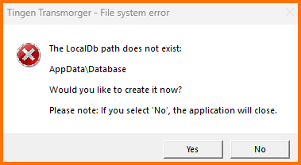
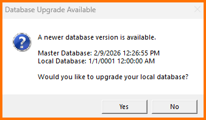
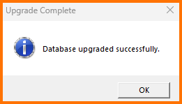
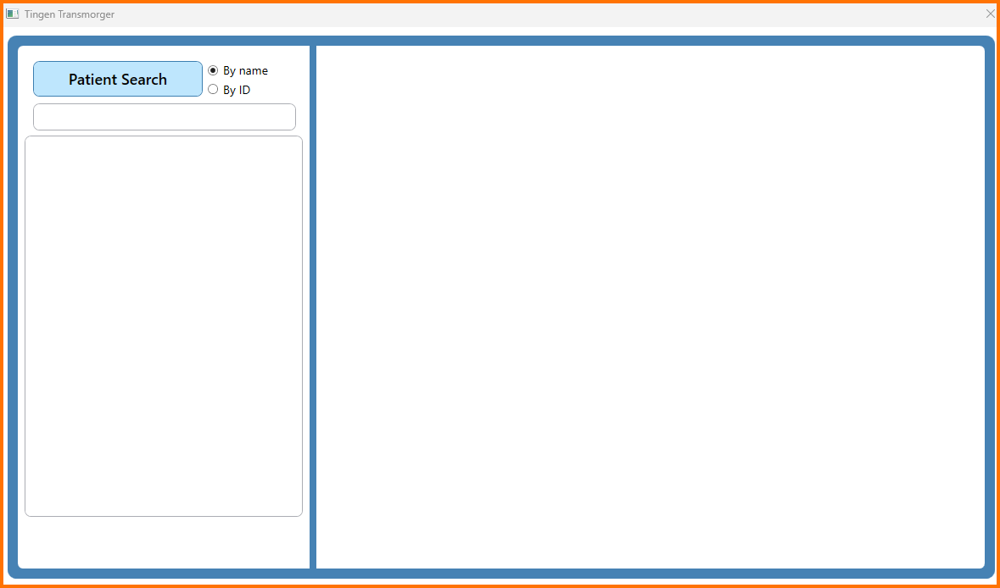

<div align="center">

  &nbsp;&nbsp;
  

</div>

# Tingen Transmorger

Tingen Transmorger is a utility for Netsmart's Avatar TeleHealth platform.

Transmorger is currently beta software.

This documentation is not final, is missing a bunch of things, and basically goes over installing Tingen Transmorger.

## Downloading Tingen Transmorger

1. Download the latest [release](https://github.com/spectrum-health-systems/TingenTransmorger/releases)
2. Extract the `TingenTransmorger.exe` file to a location of your choice.

## Initial launch of Tingen Transmorger

The first time you run `TingenTransmorger.exe`, you'll get this message:


This is because while the Transmorger configuration file has been created, it doesn't have any valid settings yet.

If you look in the location where you extracted `TingenTransmorger-x.x.x.x.zip`, you'll see the following folder/file structure:

```text
\---AppData
    \---Config
            transmorger.config
```

## Configuring Tingen Transmorger

Open the `transmorger.config` file. The contents should look like this:

```json
{
  "Mode": "Standard",
  "StandardDirectories": {
    "LocalDb": "",
    "MasterDb": ""
  },
  "AdminDirectories": {
    "Tmp": "",
    "Import": ""
  }
}
```

### Configuration settings

#### Mode

* **Standard** (Default)  
This is the default Tingen Transmorger mode, and the one you should use.

* **Admin** (Default)  
This is the adminitration Tingen Transmorger mode, used for rebuilding databases and things that normal users should not do.

#### StandardDirectories

There are two folders that standard users will need access to:

* **LocalDb**  
This is where the *local* Tingen Transmorger database is stored. You can put the database anywhere, but for organizational purposes it is recommended that you use a "Database" folder in "AppData", and point to that.

* **MasterDb**  
This is where the *master* version of Tingen Transmorger database is stored. When Tingen Transmorger starts, it will check this location to see if the *master* database is more current that the *local* database, and replace the local version if it is. It is recommended that the master database be located in a folder that all Tingen Transmorger users have access to.

#### AdminDirectories

There are two folders that admin users will need access to:

* **Tmp**  
Simply a location for temporary files used when rebuilding the Transmorger database.

* **Import**  
The files Tingen Transmorger needs to rebuild the database are located here. Eventually I'll put up and Admin Guide, but for now you don't need to worry about this (or the `Tmp` directory).

### Final transmorger.config file

Assuming you are storing the local Transmorger database in `AppData`, your folder structure should look like this:

```text
\---AppData
    \---Config
            transmorger.config
    \---Database
```

And your `transmoger.config` file should look like this:

```json
{
  "Mode": "Standard",
  "StandardDirectories": {
    "LocalDb": "\path\to\AppData\Database\",
    "MasterDb": "\path\to\master\database\"
  },
  "AdminDirectories": {
    "Tmp": "",
    "Import": ""
  }
}
```

## Launch TingenTransmorger (again)

Run `TingenTransmorger.exe` again.

If you didn't manually create `AppData/Database`, Transmorger will prompt you to create it now:



Either way, you'll get this popup letting you know that there is a newer version of the database (since the local version doesn't actually exist yet):



Click "Yes", wait a few seconds (hopefully), and then you should get this message:



Click "Ok", and you'll see the Transmorger Main Window:


