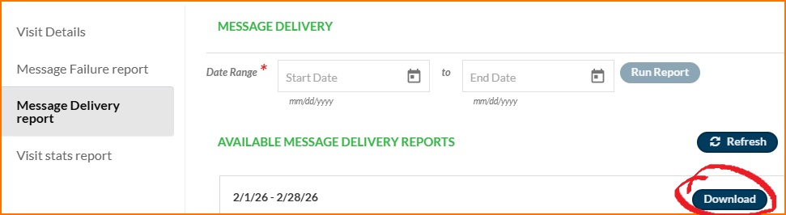
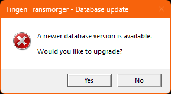

[Tingen Transmorger manual](README.md)

***

<div align="center">

  

  &nbsp;&nbsp;
  

  <h1>TINGEN TRANSMORGER MANUAL</h1>

</div>

## Contents

- [Introduction](#introduction)
  - [Requirements](#requirements)
  - [How it works](#how-it-works)
- [Installation](#installation)
- [Initial launch](#initial-launch)
  - [Setup-type thing #1: Creating the LocalDb path](#setup-type-thing-1-creating-the-localdb-path)
  - [Setup-type thing #2: The MasterDb path](#setup-type-thing-2-the-masterdb-path)
- [Configuration](#configuration)
- [Initializing the Master Transmorger database](#initializing-the-master-transmorger-database)
- [Using Transmorger]()

## Introduction

Welcome to the [Tingen Transmorger](https://github.com/spectrum-health-systems/TingenTransmorger) manual!

Tingen Transmorger is a utility that aggregates data from [Netsmart's TeleHealth](https://www.ntst.com/carefabric/careguidance-solutions/telehealth) platform. and makes it easier to troubleshoot TeleHealth issues.

### Requirements

Tingen Transmorger requires [.NET 10](https://dotnet.microsoft.com/en-us/download/dotnet/10.0), so make sure that the .NET Desktop Runtime (or the SDK, if you aren't into the whole brevity thing) is installed.

In addition, Transmorger is a 64-bit application, and will not run on 32-bit machines.

### How it works

Here's the 50,000-foot view of how Tingen Transmorger works:

- TeleHealth reports are (manually) run from the TeleHealth portal
- The completed reports are downloaded
- Transmorger takes all of the downloaded reports and ***transmorgifies*** them into a single, custom database
- That custom database is saved in a location that end-users have access to
- Transmorger automatically downloads/updates the database for end-users
- End-users can use Transmorger to troubleshoot TeleHealth issues

Before you continue, I would recommend taking a quick look at the [TeleHealth Reports Overview](TeleHealthReportsOverview.md) and [Transmorger Database Overview](TransmorgerDatabaseOverview.md)

## Installation

Tingen Transmorger is a stand-alone, portable, (in theory) cross-platform application.

To install Transmorger, just:

1. Download the latest [release](https://github.com/spectrum-health-systems/TingenTransmorger/releases)
2. Extract the `TingenTransmorger.exe` file to a location of your choice

> [!IMPORTANT]
> Verify the SHA256 hash (v0.9.29.0)
> `---`

## Initial launch

When you double-click on the `TingenTransmorger.exe` file, and launch it for the first time, it does a few setup-type things.

### Setup-type thing #1: Creating the LocalDb path

The first thing you should see when you first launch Transmorger is this popup:


The ***LocalDb path*** is where the *local copy* of the Transmorger database will stored.

When you click **Yes**, Transmorger will create an empty folder named `./AppData/Database`. This is the default (and recommended) location for the LocalDb, but you can change the LocalDb path to any location via the configuration file.

Click **Yes**.

> [!WARNING]
> Clicking **No** will exit Transmorger.  
> Subsequent launches will ask the same question, until you click **Yes**, so this step is required.

### Setup-type thing #2: The MasterDb path

Another message will popup:


The **MasterDb** is the most up-to-date version of the Transmorger database...but it doesn't actually exist yet.

We'll fix that next, so for now just click "OK", and Transmorger will exit.

## Configuration

If you take a look in the folder where `TingenTransmorger.exe` is, you'll notice there is a folder named `AppData`, which is where Transmorger will store various data that it needs to function.

You'll also see the `AppData/Database` folder that was created for the [LocalDb](#setup-type-thing-1-creating-the-localdb-path).

We're interested in other folder here: `AppData/Config`, which contains the transmorger.config` configuration file.

Let's take a look at that file, and make some changes.

### The default configuration file

The default `transmorger.config` file looks like this:

```json
{
  "Mode": "Standard",
  "StandardDirectories": {
    "LocalDb": "AppData/Database",
    "MasterDb": ""
  },
  "AdminDirectories": {
    "Tmp": "AppData/Tmp",
    "Import": ""
  }
}
```

There are three components to the configuration file:

- Mode
- StandardDirectories
- AdminDirectories

#### Mode

There are two modes that Transmorger can run in:

- **Standard**  
This is the mode that end-users should always use.

- **Admin**  
This mode is used for rebuilding the Transmorger database, and is *not* intended for end-users. You can find more information about this mode [here]().

#### Standard directories

Standard mode uses two directories:

- **LocalDb**  
This is the location for the end-users local Transmorger database. As you can see, when Transmorger is executed for the first time, and the configuration file is created, this is set to the default (and recommended) `AppData/Database`.

- **MasterDb**  
This is the location for the **master database**. The master database is the most up-to-date version of the Transmorger database, and is must be located in a location where all end-users can access it.

#### Admin directories

Admin mode uses two **additional** directories:

- **Tmp**  
Any temporary data that Transmorger needs to function is stored here. When Transmorger is executed for the first time, this is set to `AppData/Tmp`, which is the recommended location.

- **Import**  
This is the location for the TeleHealth reports that will be ***transmorgified***. This can be anywhere, but for organizational purposes I recommend putting it in the parent folder of the `MasterDb`.

### Modifying the configuration file

Now that we've gone over the contents of the the transmorger.config file, let's make some necessary changes, but not to the existing `LocalDb` and `Tmp` entries - let's leave those at their defaults.

For **standard** users, we are only going to modify the `MasterDb` setting.

For **admin** users, we are going to modify both the `MasterDb` and `Import` settings.

#### Modifying the `MasterDb` location

Modify this component of the configuration file to point to where your master database will reside.

So this:

```json
    "MasterDb": ""
```

...becomes this:

```json
    "MasterDb": "path/to/database"
```

...or a more real-world example:

```json
    "MasterDb": "Z:/Transmorger/Database"
```

This change needs to be made for both *standard* and *admin* users.

#### Modifying the `Import` location

Modify this component of the configuration file to point to where all TeleHealth reports will downloaded.

So this:

```json
    "Import": ""
```

...becomes this:

```json
    "MasterDb": "path/to/imports"
```

...or a more real-world example:

```json
    "MasterDb": "Z:/Transmorger/Import"
```

This change only needs to be made for both *admin* users.

### Saving the configuration file

Your modified `transmorger.config` file should look something like this:

```json
{
  "Mode": "Standard",
  "StandardDirectories": {
    "LocalDb": "AppData/Database",
    "MasterDb": "Z:/Transmorger/Database"
  },
  "AdminDirectories": {
    "Tmp": "AppData/Tmp",
    "Import": "Z:/Transmorger/Database"
  }
}
```

Save the changes.

Tingen Transmorger is now configured!

## Initializing the Master Transmorger database

That last thing was only *mostly* true: Tingen Transmorger needs one more configuration change, but it's a temporary one.

We need to change the **Mode** to "Admin", so we can build the initial Transmorger database.

So open the `transmorger.config` file, and change this line:

```json
    "Mode": "Standard",
```

...to this:

```json
    "Mode": "Admin",
```

...then save the configuration file.

But don't launch Transmorger yet! To build the Transmorger database, we need TeleHealth reports.

### Downloading the TeleHealth reports

So...the TeleHealth reports that Transmorger needs to build its database need to be downloaded manually.

Yeah, not great. But it is what it is.

#### The reports

--> link to thing

Each report needs a date range, and the date range should be the same for all reports.

#### Running a report

To run a TeleHealth reports:

1. Login to your TeleHealth portal
2. Click the "Reports" tab
3. Choose a report to run
4. Choose the start and end date of the report
5. Click "Run Report"

Using the "Message Delivery Report" as an example:


Some reports take longer than others, and some reports take pretty long.

While the report is being run, you'll see a "Processing" button (that's disabled).


> [!NOTE]
> All TeleHealth reports in the Import folder are used to create the Transmorger database, so you can download incremental date ranges.
>
> For example, running two reports from 1/1/2026-1/15/2015 and 1/16/20206-1/31/2026 will give you the same result as running a single report from 1/1/2026-1/31/2-26.

#### Downloading a report

Once the "Processing" button becomes the Download" button (which is enabled), download the report to your "Import" directory.



Once all reports have been downloaded, we can launch Tingen Transmorger and initialize the database.

### Creating the Master Transmorger database

First, confirm that the `transmorger.config` file has the following line:

```json
    "Mode": "Admin",
```

Then, launch Transmorger.

You'll get the following popup:


Click **Yes** to initialize the Transmorger database (which, technically, is just "rebuilding" it for the first time).

While the database is being built, you'll see a progress indicator:


When the build process is complete, you'll see a popup letting you know there is a database update available.



> [!NOTE]
> When you rebuild the Transmorger database, you are rebuilding the **master** database.
>
> Once that is complete, Transmorger checks the local version of the database to see if it's older than the master (which, in this case, it is), and prompts you to update.

Since we want that update, click **Yes**

You will then (hopefully) get a popup letting you know the database has been updated.


Click "OK", then click the "Close" button on the "Rebuilding Transmorger Database" window.


Tingen Transmorger will then launch.


# Using Transmorger


Run `TingenTransmorger.exe` again.

If you didn't manually create `AppData/Database`, Transmorger will prompt you to create it now:


Either way, you'll get this popup letting you know that there is a newer version of the database (since the local version doesn't actually exist yet):


Click "Yes", wait a few seconds (hopefully), and then you should get this message:


Click "Ok", and you'll see the Transmorger Main Window:


And here's a secret: *it doesn't have to be local*. That's right, you 

Tmp/ cleaning


***

[Tingen Transmorger manual](README.md)

> <sub>Last updated: 260304</sub>
