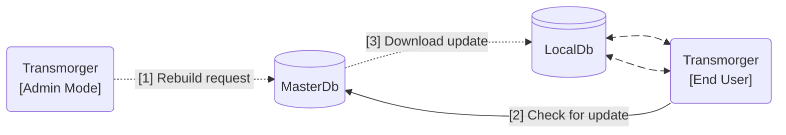

[Tingen Transmorger manual](README.md) ❰ The Transmorger Database(s)

***

  

  &nbsp;&nbsp;
  

  <h1>
    TINGEN TRANSMORGER MANUAL 
    The Transmorger Database(s)
  </h1>

### CONTENTS

- [The database(s)](#the-transmorger-databases)
    - [The local database (LocalDb)](#the-local-database-localdb)
    - [The master database (MasterDb)](#the-master-database-masterdb)
- [How the database(s) work](#how-the-databases-work)
- [Rebuilding the master database](#rebuilding-the-master-database)

# The database(s)

*Technically*, Transmorger uses two databases: the ***LocalDb***, and the ***MasterDb***.

## The local database (LocalDb)

The **LocalDb**:

- is named `transmorger.db`
- is located in `AppData/Database` (by default)
- is what Transmorger uses to do all of it's work
- is stored as a standard JSON file, to keep filesize down

Each Transmorger installation should have it's own LocalDb.

**Fun fact**: When Transmorger is launched, it checks to see if there is an updated version of the LocalDb. If there is an updated version, the user is prompted to update!

## The master database (MasterDb)

The **MasterDb**:

- is also named `transmorger.db`
- should be located where all end-users have access
- is only modified when building/rebuilding the database in *Admin mode*
- is always the most up-to-date version of the Transmorger database

**Fun fact**: End-users will probably never see the MasterDb!

# How the database(s) work

If you want something visual (that's not too abysmal):

>[1] Transmorger Admin mode can request that the MasterDb be rebuilt  
>[2] When an end-user launches Transmorger, it checks to see if the MasterDb is more current than it's LocalDb  
>[3] If the MasterDb is more current than the LocalDb, the MasterDb is copied to the end-user's machine, overwriting the current LocalDb
>
> The end-user communicates directly with the LocalDb

# Rebuilding the master database

To rebuild the MasterDb:

1. [Run the TeleHealth reports](TeleHealth-Reports.md#running-reports) with the date/date-ranges you want Transmorger to use
2. Change the Transmorger mode to "Admin" in the `./AppData/Config/transmorger.config` file
3. Launch Transmorger

The rebuild process should start.

## The rebuild process

You should get this prompt:

Click **Yes**.

While the database is being built, you'll see a progress indicator:

When the build process is complete, you'll see a popup letting you know there is a database update available.

Click **Yes**

You will then (hopefully) get a popup letting you know the database has been updated.

Click *OK*

Tingen Transmorger will then launch in Admin mode.

Exit Transmorger, change the mode to "Standard", and relaunch Transmorger as an end-user.

***

[Tingen Transmorger manual](README.md) ❰ The Transmorger Database(s)

> Last updated: 260305
