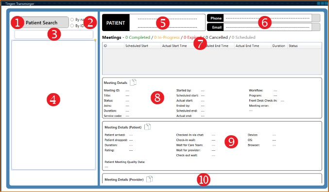
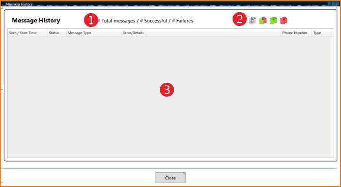
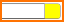
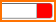
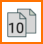

[Tingen Transmorger manual](README.md) ❰ Using Transmorger

***

  

  &nbsp;&nbsp;
  

  <h1>
    TINGEN TRANSMORGER MANUAL 
    Using Transmorger

### CONTENTS

- [The Transmorger user interface](#the-transmorger-windows)
  - [The Main window](#the-main-window)
  - [The Message Details window](#the-message-details-window)
  - [The Message Details buttons](#the-message-details-button)
  - [The Copy Data buttons](#the-copy-data-buttons)

> [!NOTE]
> The screenshots in this documentation are directly from the XAML editor in Visual Studio 2026, since using a production version of Transmorger would display patient data.

# The Transmorger user interface

The primary interfaces you will be working with are:

1. The **Main** window
2. The **Message Details** window
3. The **Message Details** buttons
4. The **Copy data** buttons

## The Main window

1. **Search toggle button**  
Clicking this button will toggle between **Patient Search** and **Provider Search**.

2. **Search By options**  
You can either search by **name** or **ID number**...but not both!

3. **Search box**  
When you type a letter (when searching by name) or number (when searching by ID), the **search results** will populate.

4. **Search results**  
Real-time search results.

5. **Patient/Provider details**  
Patient searches will display the patient name and ID.  
Provider searches will display the provider name and ID.

6. **Patient contact information**  
The patient phone number and email address will be displayed here, if they exist.  
If a contact method has any combination of successes/failures, the **Message Detail button** for that method will be available (see [the Message Detail button](#the-message-detail-button)).  
This component is not used with provider searches.

7. **Meeting list**  
When you choose one of the results in the *search results* a summary of completed/in-progress/expired/cancelled/scheduled meetings will be displayed, as well as the list of meetings for the patient/provider.

8. **Meeting details**  
Displays various *generic* details about the chosen meeting.

9. **Meeting details (patient)**  
Displays various *patient-specific** details about the chosen meeting.
This component is not used with provider searches.

10. **Meeting details (provider)**  
Displays various *patient-specific** details about the chosen meeting.
This component is not used with patient searches.

## The Message Details window

1. **Message details summary**  
A summary of total messages, successful messages, and failed messages.

2. **Copy buttons**  
Clicking one of these buttons will copy specific data to the clipboard (see [Copying Transmorger data](#copying-transmorger-data))

3. **Message detail results**  
Displays various details about messages.

## The message details button

When performing a patient search, both the **phone** and **email** contacts will have a **message detail button**. This button will be in one of four states:

- **Disabled/grey**  
  
This indicates that a phone number/email address was not found, or that delivery information does not exist, so the message details button is greyed out and disabled.

- **Green**  
  
This indicates that a phone number/email address was found, along with only successful delivery information. Clicking the button will open the Message Details window.

- **Yellow**  
  
This indicates that a phone number/email address was found, along with a mix of successful and failed delivery information. Clicking the button will open the Message Details window.

- **Red**  
  
This indicates that a phone number/email address was found, along with only failure delivery information. Clicking the button will open the Message Details window.

## The Copy Data buttons

You'll find the following **copy** icons on various components:

- **Copy all data**  
  
Clicking this icon will copy all of the data in the component.

- **Copy the top 10 results**  
  
Clicking this icon will copy the top ten results of a component.

- **Copy successes**  
  
Clicking this icon will copy any data that is classified as "successful".

- **Copy failures**  
  
Clicking this icon will copy any data that is classified as "failure".

- **Copy both success and failures**  
  
Clicking this icon will copy any data that is classified as either "successful" or "failure" (essentially all data).

[Tingen Transmorger manual](README.md) ❰ Using Transmorger

> Last updated: 260305
