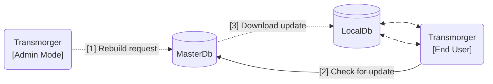

[Tingen Transmorger manual](README.md) ❰ Transmorger Database Overview

***

  

  &nbsp;&nbsp;
  

  <h1>
    TINGEN TRANSMORGER MANUAL 
    Transmorger Database Overview
  </h1>

## CONTENTS

- [The Transmorger database(s)](#the-transmorger-databases)
    - [The local database](#the-local-database)
    - [The master database](#the-master-database)
- [How the database(s) work](#how-the-databases-work)

## The Transmorger database(s)

*Technically*, Transmorger uses two databases: the ***LocalDb***, and the ***MasterDb***.

### The local database

The **LocalDb**:

- is named `transmorger.db`
- is located in `AppData/Database` (by default)
- is what Transmorger uses to do all of it's work
- is stored as a standard JSON file, to keep filesize down

Each Transmorger installation should have it's own LocalDb.

When Transmorger is launched, it checks to see if there is an updated version of the LocalDb. If there is an updated version, the user is prompted to update.

### The master database

The **MasterDb**:

- is also named `transmorger.db`
- should be located where that all end-users have access to (recommended)
- is only accessed when building/rebuilding the database in *Admin mode*
- is always the most up-to-date version of the Transmorger database

End-users will probably never see the MasterDb

## How the database(s) work

If you want something visual (that's not too abysmal):

>[1] Transmorger Admin mode can request that the MasterDb be rebuilt  
>[2] When an end-user launches Transmorger, it checks to see if the MasterDb is more current than it's LocalDb  
>[3] If the MasterDb is more current than the LocalDb, the MasterDb is copied to the end-user's machine, overwriting the current LocalDb
>
> The end-user communicates directly with the LocalDb

***

[Tingen Transmorger manual](README.md) ❰ Transmorger Database Overview

> Last updated: 260304
